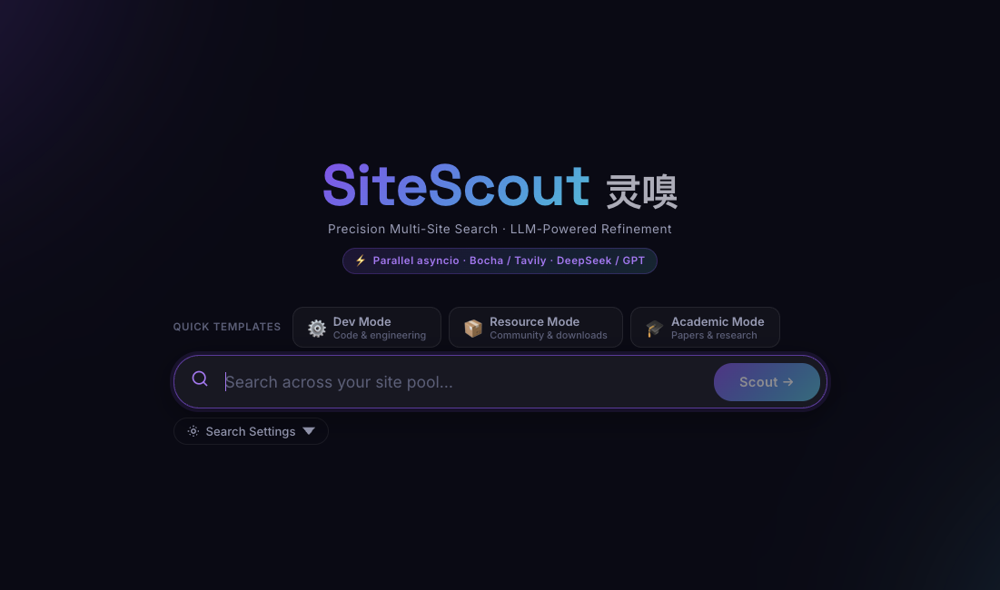

# 🕵️‍♂️ SiteScout (灵嗅)

**A Precision Multi-Site Search & LLM-Powered Resource Refinement Agent.**

[](https://www.google.com/search?q=LICENSE)
[](https://www.python.org/)
[](https://www.deepseek.com/)

-----

## 🌟 Overview

**SiteScout** is a specialized AI Agent designed for "Digital Archeology." It solves the pain points of searching for niche resources in specific forums or vertical sites where information density is low, ads are rampant, and links are often dead or hidden.

Unlike blind global searches, SiteScout follows a **"Targeted Penetration + Funnel Refinement"** architecture. It allows users to define a "Trusted Site Pool," concurrently scrapes these sites, and leverages **LLM** to automatically identify, extract, and verify authentic download links.

-----

## ✨ Key Features

  * **🎯 Domain-Specific "Sniper" Search**: Supports custom `site:` operator lists. Dig deep into specific niche forums (e.g., Reddit, V2EX, GitHub) rather than the noisy open web.
  * **🌪️ The Resource Funnel (Map-Reduce)**:
      * **Raw Data**: Retains up to 20 raw search results per site for manual verification.
      * **Refined Summary**: An LLM-distilled "Quick List" generated from the top $K$ results across all sites.
  * **🧠 Intelligent De-noising**: Automatically filters out "Join group for link," "Reply to see," and fake redirection ads.
  * **⚡ High-Performance Concurrency**: Built with `httpx` and `asyncio`, performing multi-site lookups simultaneously, reducing response latency by up to 70%.
  * **🌐 Developer Friendly**: Native support for **DeepSeek**, **Bocha AI**, and **Exa AI** APIs.

-----

## 🏗️ Architecture

SiteScout utilizes a decoupled modular design:

1.  **Input Layer**: Receives search queries, a target domain list, `raw_n` (display count), and `llm_k` (refinement count).
2.  **Dispatcher**: Orchestrates the workflow into parallel asynchronous retrieval tasks.
3.  **Retrieval Layer**: Uses Search Engine APIs (Bocha/Exa/Serper) with specialized `site:` operators.
4.  **Pre-filter**: Sorts results based on keyword relevance (e.g., "pan", "magnet", "download", "release").
5.  **LLM Refiner**: DeepSeek-R1 extracts download links, passwords, and resource integrity status.
6.  **Presentation Layer**: Structurally renders a Markdown table summary followed by the raw data logs.

-----

## 🚀 Quick Start

### 1\. Clone the Repository

```bash
git clone https://github.com/YourName/SiteScout.git
cd SiteScout
```

### 2\. Configuration

Create a `.env` file and add your API keys:

```env
DEEPSEEK_API_KEY=your_key_here
BOCHA_API_KEY=your_key_here  # Or TAVILY_API_KEY / EXA_API_KEY
```

### 3\. Install & Run

```bash
pip install -r requirements.txt
python main.py
```

-----

## 💡 Usage Example

**Input:**

  * **Query**: `Black Myth Wukong Optimization Patch`
  * **Sites**: `v2ex.com, github.com, reddit.com`
  * **Params**: `raw_n=20, llm_k=5`

**Output:**

> **💎 AI Refined Summary**
> | Resource | Source | Download Link | Password | Status |
> | :--- | :--- | :--- | :--- | :--- |
> | v1.0.8 Performance Fix | GitHub | `https://github.com/.../releases` | N/A | ✅ Verified |
> | Community Mod | Reddit | `https://mega.nz/...` | `scout2026` | ⚠️ Use with caution |
>
> **🔍 Raw Search Details (60 total results)**
>
>   - [GitHub] Update on performance optimization...
>   - [V2EX] Does anyone have the new patch...

-----

## 🛠️ Tech Stack

  * **Brain**: [DeepSeek-R1 / V3](https://www.deepseek.com/)
  * **Search Engine**: [Bocha AI](https://open.bochaai.com/) / [Exa AI](https://exa.ai)
  * **Framework**: FastAPI / Antigravity / Dify
  * **Concurrency**: Python Asyncio & `httpx`

-----

## 🤝 Contributing

Contributions are welcome\! If you find this tool helpful, please give it a **Star** 🌟. It means a lot to a growing AI Engineer\!

-----